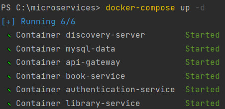
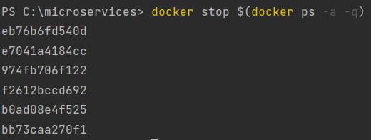
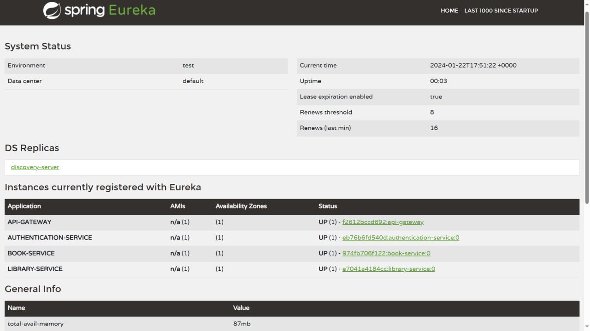
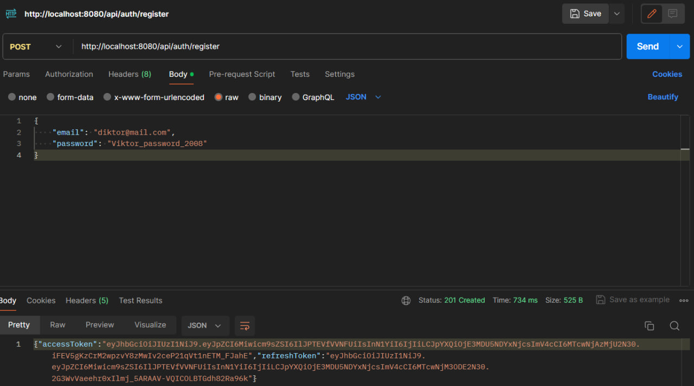
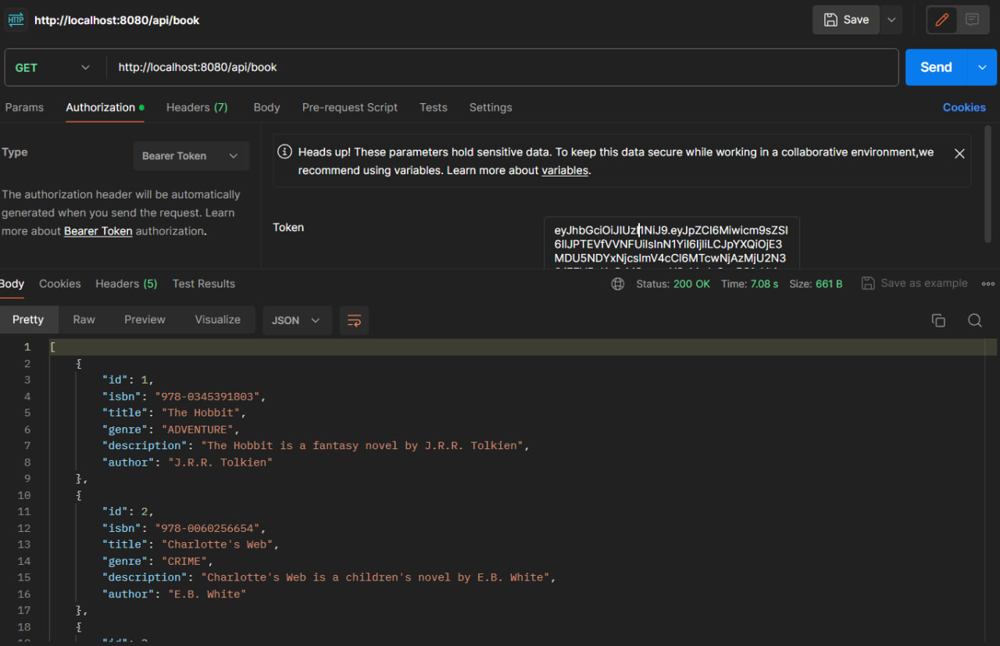

# Spring (Cloud, MVC, JPA) Microservices with Hibernate, JWT filter, MySQL DB, FlyWay, Swagger docs

---

This application utilizes a microservices approach. It is built using Spring (Cloud, MVC, Data), Hibernate, JWT filter, MySQL DB, FlyWay, documented with Swagger, containerized with Docker (Docker Compose). The application has a well-structured architecture, including an API gateway, Discovery Server, and services such as the book service, library service, and authentication service. Inter-service communication has been implemented, and the Circuit Breaker pattern has been applied.

---

## Quick Start
#### Run app with the help of Docker Compose:

    docker-compose up -d

#### Stop application:

    docker stop $(docker ps -a -q)

---

#### 4) Eureka/Swagger End Points:
    Eureka endpoint: localhost:8080/eureka/web

    Swagger endpoint: localhost:8080/swagger-ui.html

---
#### 5) Requests example
Register request:

All requests are secured with JWT token.

---

    

