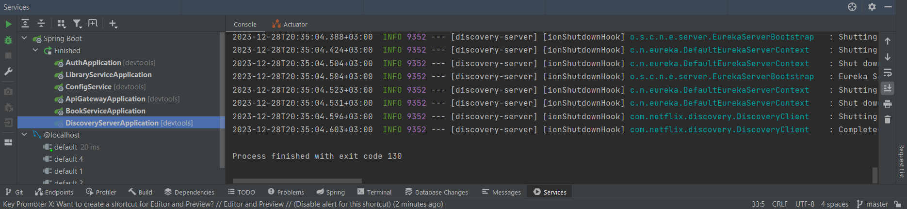
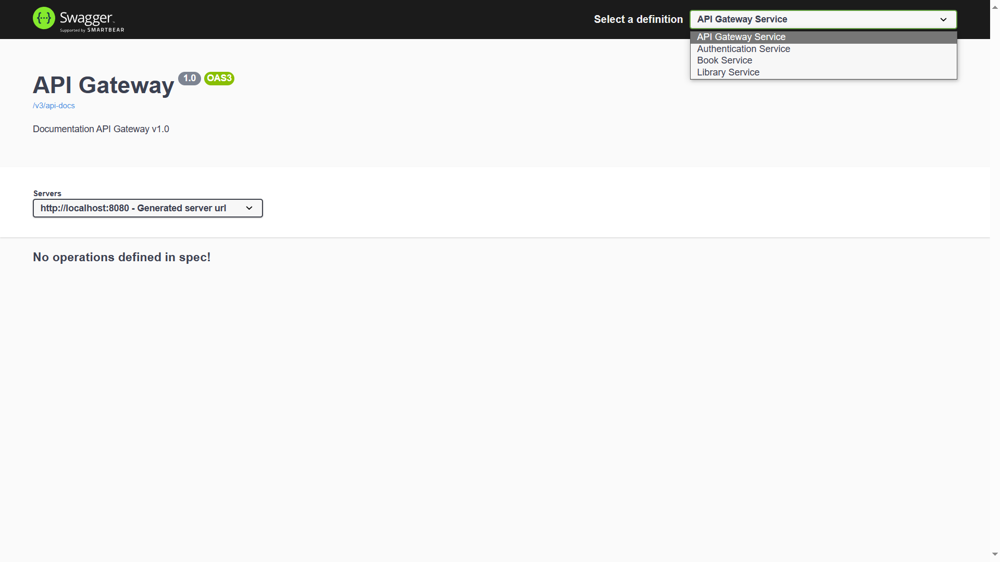
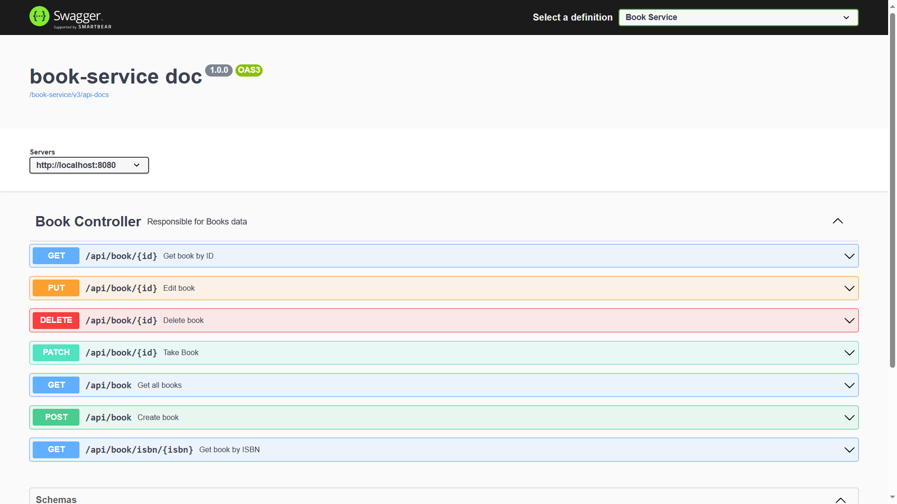

# **Spring (Cloud, MVC, JPA) Microservices with Hibernate, JWT filter, MySQL DB, FlyWay, Swagger docs**
Quick Start
---  
#### 1) Clone repository
    git clone https://github.com/viktordiktor/springReactRent.git
---  
#### 2) Configure your app
    In every service, change:
    spring.datasource.url=jdbc:mysql://localhost:3306/*DB_name*
    spring.datasource.username=*DB_user*
    spring.datasource.password=*DB_password*

#### 3.1) Run services with the help of terminal
    cd discovery-server
    mvn spring-boot:run

    cd config-service
    mvn spring-boot:run

    cd api-gateway
    mvn spring-boot:run

    cd book-service
    mvn spring-boot:run

    cd authentication-service
    mvn spring-boot:run

    cd library-service
    mvn spring-boot:run

#### 3.2) Run services with the help of IntelliJ IDE
    Order: DiscoveryServerApplication -> ConfigService -> ApiGatewayApplication  
    -> BookServiceApplication -> AuthApplication -> LibrarySerivceApplication

#### 3.3) Run with the help of Docker Compose
    Soon...
---
#### 4) Eureka/Swagger End Points:
    Eureka endpoint: localhost:8080/eureka/web
    Swagger endpoint: localhost:8080/swagger-ui.html

---
#### 5) Enjoy :)
All requests are secured with JWT token.
Get access token: 

    POST-request - http://localhost:8080/api/auth/register
    Body example:
    {
            "email": "email",
            "password": "password"
    }
    

